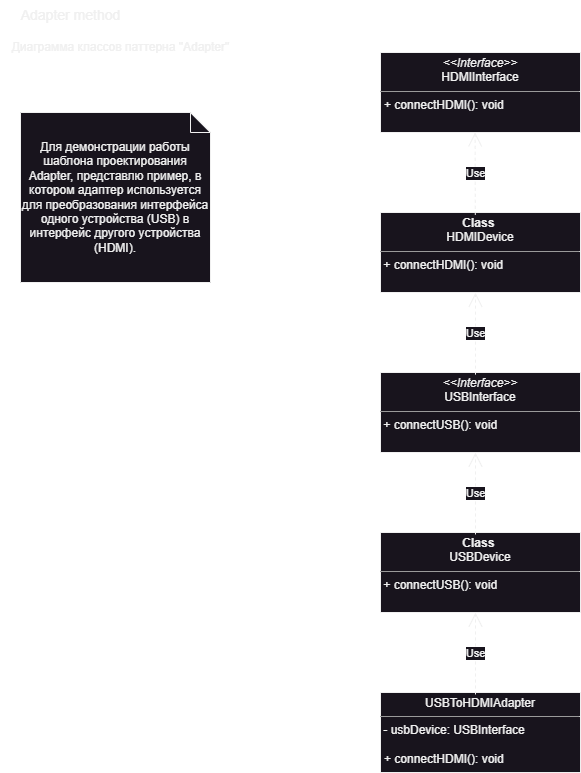

1.Разработать UML-диаграмму для демонстрации работы шаблона проектирования (ОДНОГО, ЛЮБОГО ИЗ СПИСКА) Singleton, Builder, Adapter, Facade, Decorator, Proxy, Observer, Mediator ИЛИ ЛЮБОГО ДРУГОГО НА ВАШ ВЫБОР (как мы это делали на семинаре).
2**. Продемонстрировать работу этого шаблона проектирования в вашей программе (как мы это делали на семинаре).

Для демонстрации работы шаблона проектирования Adapter, представлю пример, в котором адаптер используется для преобразования интерфейса одного устройства (USB) в интерфейс другого устройства (HDMI).

Объяснение диаграммы:

HDMIInterface - это интерфейс, представляющий стандартный интерфейс HDMI с методом connectHDMI().

HDMIDevice - это класс HDMI-устройства, который реализует интерфейс HDMIInterface. У него есть метод connectHDMI().

USBInterface - это интерфейс, представляющий стандартный интерфейс USB с методом connectUSB().

USBDevice - это класс USB-устройства, который реализует интерфейс USBInterface. У него есть метод connectUSB().

USBToHDMIAdapter - это адаптер, который реализует интерфейс HDMIInterface. 
Он содержит композиционную связь с USBInterface (usbDevice), который он адаптирует к интерфейсу HDMI. 

Метод connectHDMI() в адаптере преобразует вызов в connectUSB() USB-устройства и затем сообщает, что HDMI-устройство подключено через USB.

